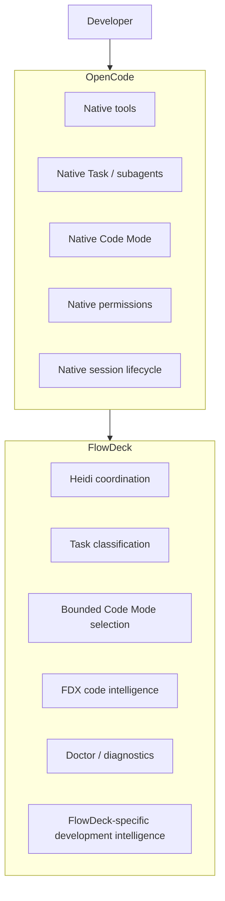
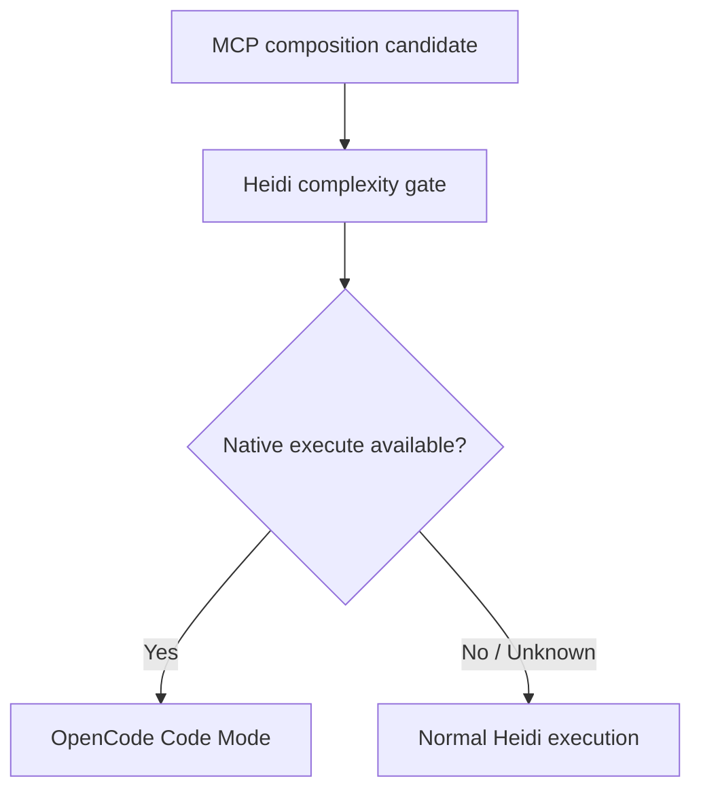

# FlowDeck

FlowDeck is an OpenCode-native development intelligence layer built around Heidi, a coordinator that decides when to work directly, when to delegate, and when a small tool composition is better handled by OpenCode's native Code Mode.

[](https://www.npmjs.com/package/@heidi-dang/flowdeck)
[](https://opensource.org/licenses/MIT)

**14 registered agents** | **11 specialized subagents** | **89 validated skills** | **15 registered commands**

## Overview

FlowDeck extends OpenCode instead of replacing it. By acting as a specialized orchestration and intelligence layer atop OpenCode, FlowDeck brings deterministic routing, deep codebase analysis via native Rust extensions (FDX), and multi-agent delegation, while deferring execution, sandboxing, and session lifecycles to OpenCode's robust native environment.

## Why FlowDeck Exists

Modern code generation requires complex reasoning across large repositories. A single LLM prompt often lacks the necessary precision to both explore a repository and execute a complex, multi-file refactor safely. FlowDeck exists to manage this complexity by separating structural orchestration (Heidi) from sandboxed atomic execution (OpenCode).

## What FlowDeck Adds to OpenCode

FlowDeck introduces autonomous multi-agent coordination, deterministic capability routing, and high-performance Rust-backed repository analysis. It categorizes tasks and routes them efficiently—whether directly applying a small edit, delegating a systemic change to specialized subagents, or leveraging OpenCode's native Code Mode for quick contextual lookups.

## Architecture



## Heidi

Heidi acts as FlowDeck's primary coordinator, analyzing user requests to route them efficiently across available systems.

### When Heidi Acts Directly
For focused, single-domain changes (e.g., updating a component, fixing a localized bug), Heidi processes the request directly using a fast, lean system prompt (under 600 baseline tokens).

### When Heidi Uses Specialists
For architectural overhauls, security audits, or cross-cutting migrations, Heidi delegates to specialized subagents using OpenCode's `OPENCODE_EXPERIMENTAL_BACKGROUND_SUBAGENTS` capability. This parallelizes workstreams without stalling the primary session.

### When Heidi Uses Code Mode
When an action fits the profile of a small MCP (Model Context Protocol) composition, Heidi delegates the operation to OpenCode's native Code Mode.

## Native Code Mode Integration

FlowDeck respects OpenCode as the authoritative environment for actual execution and confinement.

### Capability Model

Code Mode capabilities are strictly modeled:



| State | Definition |
| --- | --- |
| `UNAVAILABLE` | Code Mode is disabled or explicitly unsupported. |
| `UNKNOWN` | Code Mode is enabled but no eligible MCP context was detected. |
| `AVAILABLE` | Code Mode is enabled and eligible. Heidi may select native Code Mode. |

### Bounded Composition Model

Heidi Code Mode selection-policy bounds restrict when an operation qualifies for native execution:

| Policy | Bound |
| --- | --- |
| Tool calls | 10 |
| Parallel calls | 4 |
| Dependency stages | 3 |
| Collection items | 25 |
| Source guidance | 80 lines / 12 KiB |
| Timeout target | 30 seconds |
| Result target | 64 KiB |
| Retries | 0 |
| Recursion | disabled |
| Nested execute | disabled |
| Agent spawning | disabled |

### Example: Suitable for Code Mode

**User:**
> "List the open GitHub bug issues, inspect the related pull requests, and show which PR appears to address each issue."

**Heidi:**
1. Recognizes a small MCP composition.
2. Confirms native Code Mode is `AVAILABLE`.
3. Uses OpenCode execute for the bounded fetch/correlate operation.
4. Receives structured evidence.
5. Produces the final explanation.

### Example: Stays in Normal Heidi

**User:**
> "Fix this race condition in src/index.ts."

**Heidi:**
This requires repository mutation, debugging, and verification. Heidi classifies this as development execution, skipping Code Mode entirely to perform iterative fixes using the primary OpenCode native task lifecycle.

## FDX Code Intelligence

FlowDeck includes FDX, a native Rust binary designed for high-performance, deterministic repository intelligence. (FDX remains outside OpenCode 1.18.20 native Code Mode to maintain secure execution boundaries).

* **Search:** Regex and semantic lookups across the repository.
* **Read:** Bounded file extraction with line-number correlation.
* **Outline:** AST-aware symbol resolution and structural summarization.
* **Impact Analysis:** Pre-computation of refactor touchpoints.
* **Evidence-Oriented Understanding:** Immutable state snapshots for multi-agent reasoning.

## FlowDeck Doctor

FlowDeck includes a comprehensive diagnostic suite (`flowdeck doctor`) to evaluate environment configuration, runtime plugin paths, expected capabilities, and OpenCode compatibility. It verifies your setup locally before execution.

## Installation

```bash
# Automated install (recommended)
curl -fsSL https://raw.githubusercontent.com/heidi-dang/flowdeck/main/install.sh | bash

# Or install via npm
npm install -g @heidi-dang/flowdeck

# Register the plugin with OpenCode
flowdeck install
```

## Quick Start

Start OpenCode normally. FlowDeck attaches automatically to the OpenCode runtime if the plugin is successfully registered.

```bash
opencode run --agent heidi "Perform a security audit on the user authentication flow."
```

## Typical Workflows

1. **Bug Resolution:** Heidi investigates the stack trace using FDX, formulates a fix, applies the patch, and triggers a local test run.
2. **Exploratory Research:** Heidi dispatches a small Code Mode task to fetch external MCP documentation, reviews the response, and integrates the findings.
3. **Large Migrations:** Heidi spawns specialized background subagents to migrate independent modules in parallel, tracking checklist completion natively.

## Architecture Ownership

| Capability | Owner |
| --- | --- |
| Model execution | OpenCode |
| Shell and native tools | OpenCode |
| Session lifecycle | OpenCode |
| Task/subagent lifecycle | OpenCode |
| Code Mode runtime | OpenCode |
| Permissions | OpenCode |
| Heidi coordination policy | FlowDeck |
| Task classification | FlowDeck |
| Code Mode selection policy | FlowDeck |
| FDX code intelligence | FlowDeck |
| FlowDeck Doctor | FlowDeck |

## OpenCode Compatibility

FlowDeck requires OpenCode version **1.18.20** for exact qualification alignment and optimal capability mapping.

## Configuration

FlowDeck utilizes a `.flowdeck.json` or `.opencode/opencode.json` integration configuration within the project root. Configurations govern governance modes (strict, advisory, off) and FDX fallback preferences.

<details>
<summary>Example Configuration</summary>

```json
{
  "governance": "strict",
  "mcp": {
    "enabled": true
  }
}
```

</details>

## Development

```bash
# Clone the repository
git clone https://github.com/heidi-dang/FlowDeck.git
cd FlowDeck

# Install dependencies
npm ci

# Build the project
bun run build
```

## Testing

FlowDeck maintains a strict qualification pipeline:

```bash
# Run unit tests
bun test

# Validate documentation
bun run validate:docs

# Check coverage
bun run test:coverage

# Run Rust FDX checks
cargo test --workspace --all-targets --all-features
```

## Release & Package Information

The FlowDeck distribution is compiled into a self-contained NPM package `@heidi-dang/flowdeck`. Version `2.4.0` represents the fully-qualified OpenCode-Native Heidi Code Mode release.

## Security and Trust Boundaries

FlowDeck respects OpenCode's native permissions and Trust Boundaries.
* Sensitive actions (`git push`, `npm publish`, cloud deployments) are explicitly tracked.
* No credentials, caches, or session exports are included in the published NPM tarball.
* FlowDeck relies strictly on the isolated `OPENCODE_EXPERIMENTAL_CODE_MODE` sandbox.

## Contributing

See the `AGENTS.md` and `CLAUDE.md` files for repository rules, ECC-aligned guidelines, and local agent constraints.

## License

MIT License. See [LICENSE](LICENSE) for details.
