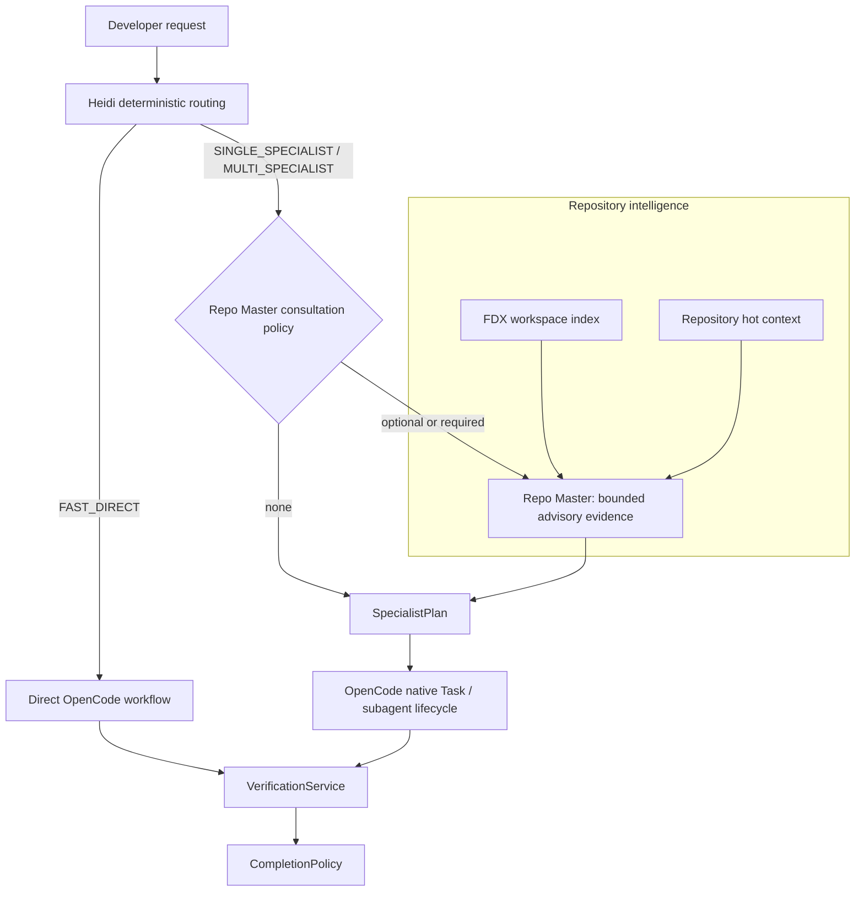

# FlowDeck

[](https://www.npmjs.com/package/@heidi-dang/flowdeck)
[](LICENSE)

**FlowDeck v2.5.0** is an OpenCode plugin that adds deterministic task routing, bounded repository intelligence, specialist coordination, governance, and FDX code intelligence to software-development workflows. It extends OpenCode rather than replacing OpenCode’s execution environment.

**89 validated skills**

> **Design principle:** FlowDeck decides and coordinates within explicit bounds. OpenCode remains the authority for model execution, native tools, sandboxing, sessions, and Task/subagent execution.

## Overview

FlowDeck’s primary coordinator, **Heidi**, classifies each user task before repository investigation. Small work follows a lean direct path. Repository-significant work can use an advisory **Repo Master** consultation and a durable `SpecialistPlan`, then dispatches work through OpenCode’s native Task/subagent lifecycle. Verification and terminal completion remain separate, evidence-based authorities.

| Capability | Primary authority | FlowDeck contribution |
| --- | --- | --- |
| Model execution, native tools, sandboxing, sessions | OpenCode | Supplies routing and policy context only. |
| Native Task and subagent lifecycle | OpenCode | Maps approved specialist plans to native lifecycle events. |
| Task routing and orchestration policy | FlowDeck / Heidi | Classifies work, persists routing evidence, and coordinates the active run. |
| Specialist planning | FlowDeck `SpecialistPlan` | Validates targets, deduplicates, orders dependencies, enforces caps, and preserves inherited model policy. |
| Repository intelligence | FDX and Repo Master | Provides bounded repository facts and advisory scope evidence. |
| Verification and terminal completion | FlowDeck `VerificationService` and `CompletionPolicy` | Evaluates explicit verification evidence; advisory prose never completes work. |

## Architecture



The diagram intentionally separates **advice**, **planning**, **execution**, **verification**, and **completion**. Repo Master is not an agent, scheduler, source-of-truth code index, model router, execution engine, verifier, or completion authority.

## Adaptive execution modes

Heidi uses a deterministic route before expensive repository work. The execution mode controls the amount of planning and whether Repo Master is consulted.

| Mode | Intended work | Repo Master behavior | Specialist behavior |
| --- | --- | --- | --- |
| `DIRECT` | Trivial, localized work | Not consulted. No repository scan is started by the direct path. | No specialist plan. |
| `SINGLE_SPECIALIST` | A focused domain task such as security, UI, backend, or review | Optional when useful to scope a focused repository task. | One validated specialist with inherited model and tool policy. |
| `MULTI_SPECIALIST` | Cross-domain or repository-significant work | Required for applicable multi-specialist routes; a failure blocks instead of inventing evidence. | Planner retains capability selection, deduplication, dependencies, and fan-out limits. |
| Standard or deep work | Larger implementation, migration, or release qualification | Routed under the same bounded policy when specialist planning is active. | Existing lifecycle and verification gates remain in force. |

### Repo Master: bounded advisory intelligence

Repo Master reuses the existing `FdxWorkspaceIndex` and repository hot-context primitives. It creates compact advice containing bounded relevant scope, likely tests, dependency edges, risks, constraints, and suggested *capabilities*. It does not retain source blobs, hidden reasoning, prompts, credentials, model identifiers, or native execution state.

Advice is bound to a deterministic repository identity and source-state fingerprint. Freshness considers the canonical workspace root, Git HEAD and branch, meaningful dirty-tree state, package manifests, and FlowDeck configuration. Repo Master ignores only its own generated metadata files; user-authored files, including user-managed `.flowdeck` content, remain meaningful source changes.

| Boundary | Behavior |
| --- | --- |
| Shared state | `.flowdeck/repo-master.json` stores compact repository metadata only and is written atomically. |
| Run-specific evidence | Persists only on the existing canonical routing decision for that run. It is not stored in shared Repo Master state. |
| Restart | Valid routing evidence can be read from the durable routing decision and is revalidated against current repository state. |
| Corruption or mismatch | Fails closed; malformed, oversized, stale, or cross-repository advice is not reused. |
| Cancellation, replacement, and modification | Superseded advice cannot be dispatched into a later run. |

Repo Master can influence a specialist objective or scope only after its suggestions pass the existing SpecialistPlan validation path. It cannot introduce an agent, choose a model, recursively delegate, or bypass planner policy.

## Reliability, verification, and completion

FlowDeck’s lifecycle distinguishes a plan from evidence that work is complete.

| Concern | Guardrail |
| --- | --- |
| Specialist recursion | Specialists have no delegation authority and a maximum depth of one is enforced. |
| Fan-out and duplication | `SpecialistPlan` validates capability targets, removes duplicates, checks dependencies, and applies configured limits. |
| Stale repository advice | Native specialist dispatch rechecks required advice freshness immediately before launch. |
| Required consultation failure | The route or dispatch is blocked explicitly; no substitute advice is fabricated. |
| Repository mutation | Observed meaningful mutations invalidate advisory repository intelligence. |
| Metrics | Repo Master metrics are aggregate-only: consultations, cache outcome, refreshes, stale observations, and latency. No repository path, prompt, model, session, or run labels are emitted. |
| Verification | `VerificationService` evaluates explicit verification evidence. |
| Completion | `CompletionPolicy` is the only terminal-completion authority. Repo Master and specialist prose cannot complete a run. |

## FDX code intelligence

FDX is FlowDeck’s repository-intelligence foundation. Repo Master uses its existing workspace index rather than implementing a second index.

| FDX capability | Purpose |
| --- | --- |
| Search and bounded reads | Locate code and provide line-correlated context. |
| Outline and impact analysis | Produce structural and change-impact facts for repository work. |
| Workspace snapshots | Reuse bounded, incrementally refreshed repository metadata. |
| Native parity | TypeScript and native Rust behavior are qualified through the repository’s FDX parity gate. |

## Compatibility

| Dependency | Requirement |
| --- | --- |
| FlowDeck package | `@heidi-dang/flowdeck` v2.5.0 |
| Node.js | `>=20.0.0` |
| OpenCode | `>=1.18.18` |
| Package manager | npm for installation and the documented package scripts; Bun is used by the test and build tooling. |

## Installation

Install FlowDeck globally, then register the plugin with OpenCode:

```bash
npm install -g @heidi-dang/flowdeck
flowdeck install
flowdeck verify
flowdeck doctor
```

For a project-local OpenCode registration, run the installer from the project root:

```bash
flowdeck install --project
flowdeck verify
```

For a local checkout during development, use the explicit local-repository mode:

```bash
flowdeck install --local-repo
flowdeck verify
```

The CLI also supports `flowdeck update`, `flowdeck config validate`, `flowdeck migrate`, `flowdeck rollback`, `flowdeck uninstall`, `flowdeck dry-run`, and `flowdeck clean-install --yes`. Run `flowdeck --help` for the complete local command reference.

## Configuration

Project configuration is loaded from `.flowdeck.jsonc` or `.flowdeck.json`; JSONC is supported. Configuration is optional. The following example uses supported schema keys and keeps routing explicit:

```jsonc
{
  "routing": {
    "enabled": true,
    "mode": "enforce"
  },
  "maxDelegationDepth": 1,
  "governance": {
    "mode": "strict",
    "verification": {
      "enabled": true,
      "requireVerificationBeforeComplete": true
    },
    "delegationBudget": {
      "maxDelegations": 8,
      "maxDepth": 1
    }
  }
}
```

`governance.mode` accepts `off`, `advisory`, or `strict`. Routing accepts `off`, `shadow`, or `enforce`. Per-agent model overrides are optional; when unset, specialists inherit the configured runtime model policy rather than receiving a Repo Master-selected model.

After editing FlowDeck project configuration, run the repository diagnostics:

```bash
flowdeck doctor
```

`flowdeck config validate` validates OpenCode plugin registration JSON/JSONC. Use the project-local form when `.opencode/opencode.json` exists:

```bash
flowdeck config validate --project
```

## Development

```bash
git clone https://github.com/heidi-dang/FlowDeck.git
cd FlowDeck
npm ci
npm run build
npm run typecheck
npm run lint
```

To build the optional native FDX binary in a Rust-enabled environment:

```bash
npm run build:fdx
npm run check:fdx
```

## Testing and qualification

Run the normal deterministic suite first, then use the focused qualification commands appropriate to the change:

```bash
npm test
npm run typecheck
npm run lint
npm run test:fdx-parity
npm run test:persistence
npm run validate:docs
npm run build
```

Additional repository gates include `npm run test:coverage`, `npm run verify:orchestration:schema`, `npm run check:schema-generated`, `npm run verify:full`, and `npm run verify:clean-install`. Release candidates also use `npm run verify:release` on an approved release branch. These commands validate; they do not publish packages, create releases, or merge pull requests.

## Security and trust boundaries

FlowDeck is designed to preserve explicit authority and containment boundaries.

- OpenCode retains sandbox, session, native-tool, and Task/subagent execution authority.
- FlowDeck’s governance layer evaluates tool and delegation policy before runtime actions.
- High-risk external operations remain subject to their applicable approval and permission controls.
- Repo Master stores bounded metadata and routing evidence, not repository source copies, credentials, prompts, or model-selection state.
- Generated Repo Master metadata is isolated under `.flowdeck`; user-managed repository files are never silently ignored as non-meaningful changes.
- Doctor and verification commands provide diagnostic and evidence checks; they do not claim work is complete without the established completion policy.

Report security issues through the repository’s maintainers rather than publishing sensitive details in a public issue.

## Contributing

Contributions should preserve FlowDeck’s authority boundaries and keep deterministic gates green. Start by reading the repository guidance, make focused changes with matching tests, and run the relevant commands from the testing section before opening a pull request. Do not introduce a parallel scheduler, execution engine, source index, model router, verification authority, or completion authority when extending orchestration behavior.

## License

FlowDeck is released under the [MIT License](LICENSE).
